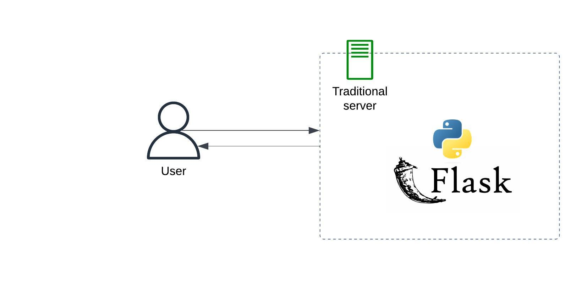
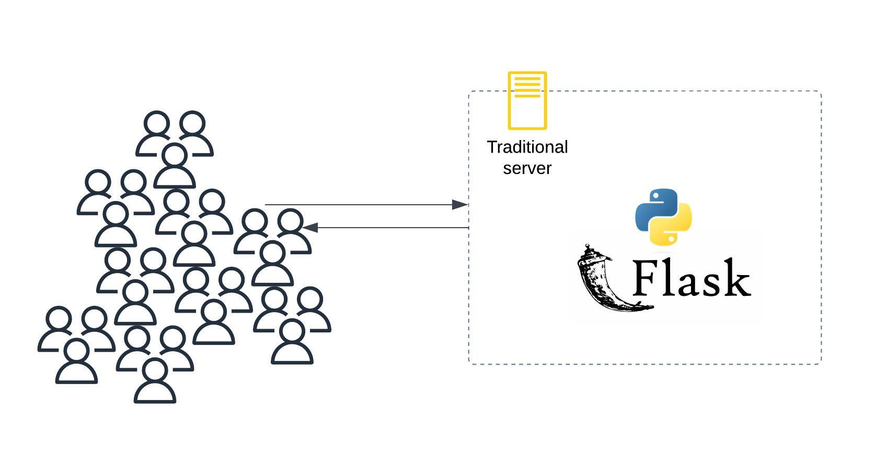
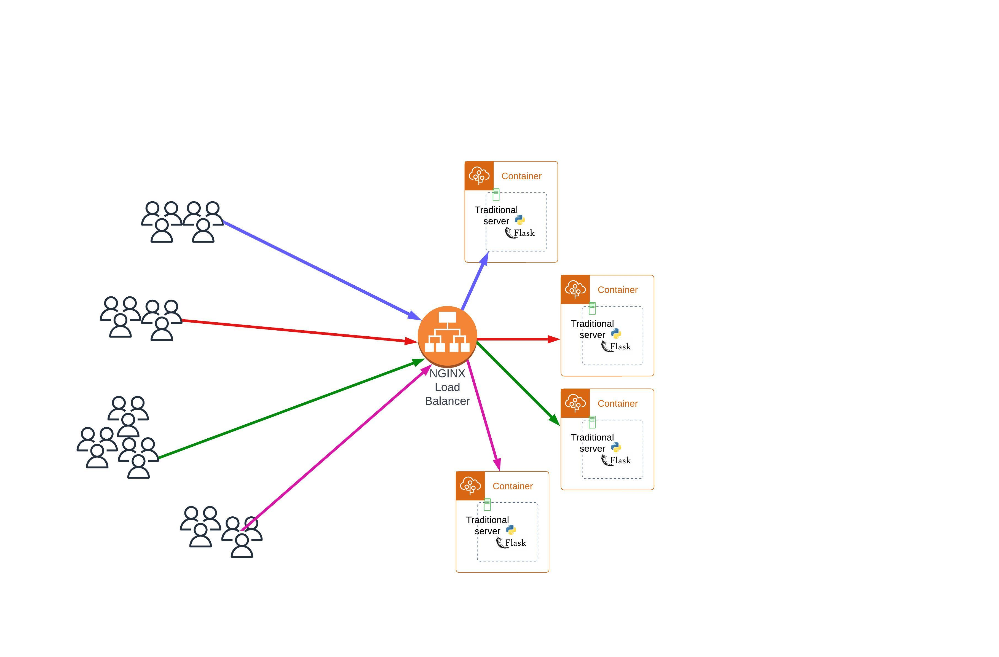

# How to Scale your Application using Docker

## A Starter Flask App

## What happens when there are multiple users?

## Solution: Load Balancing

Note: This is work in progress. More will be written soon.
